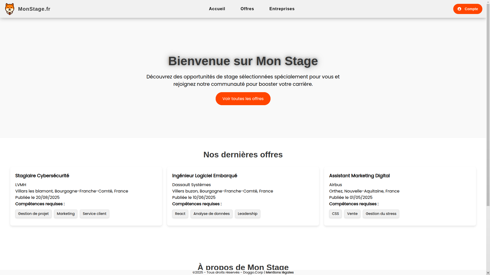
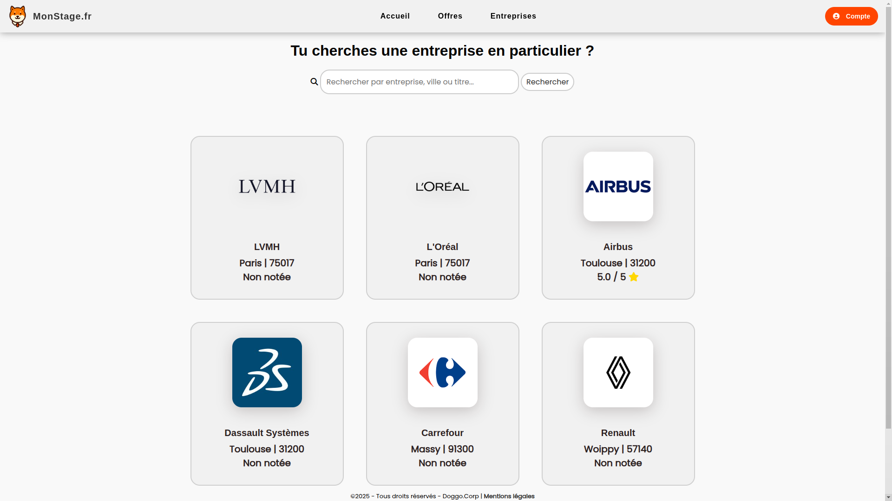
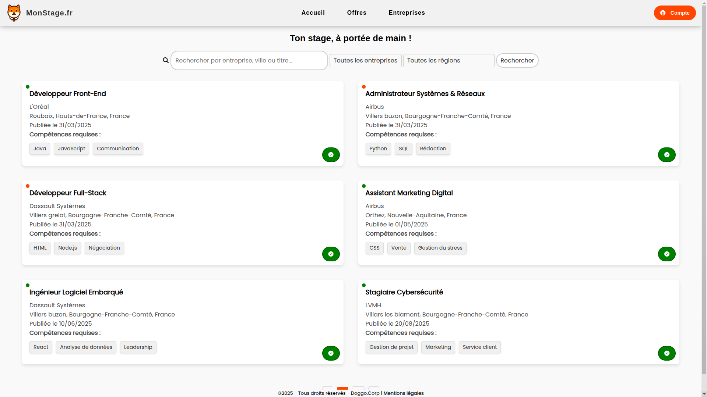
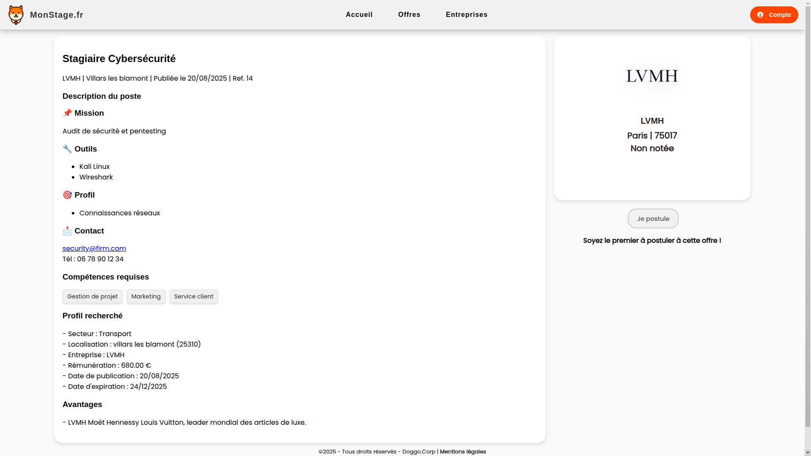

# 🌟 MonStage

[](LICENSE)
[](https://www.php.net/)
[](#contribution)

MonStage est une application web conçue pour **faciliter la recherche de stages** pour les étudiants. Elle offre une interface conviviale et moderne, rassemblant toutes les fonctionnalités nécessaires pour trouver et postuler à des offres de stage. 🚀

---

## 📚 Table des matières
1. [📖 Présentation](#présentation)  
2. [✨ Fonctionnalités](#fonctionnalités)  
3. [⚙️ Prérequis](#prérequis)  
4. [📥 Installation](#installation)  
5. [📊 Peuplement de la base de données (Optionnel)](#peuplement-de-la-base-de-données-optionnel)  
6. [🚀 Lancement](#lancement)  
7. [🤝 Contribution](#contribution)  
8. [🖼️ Aperçus](#aperçus)  
9. [📜 Licence](#licence)  
10. [👥 Auteurs](#auteurs)

---

## 📖 Présentation
MonStage vous permet de :  
- 🔍 **Rechercher des stages** adaptés à vos critères.  
- 📄 **Gérer vos candidatures** en un coup d'œil.  
- 🏢 **Publier et gérer des offres** pour les entreprises partenaires.

---

## ✨ Fonctionnalités
- 🔍 **Recherche de stages** : Trouvez des stages correspondant à vos critères.  
- 📄 **Gestion des candidatures** : Suivez vos candidatures facilement.  
- 🏢 **Gestion des entreprises** : Ajoutez et gérez les entreprises partenaires.  
- 🎨 **Interface utilisateur intuitive** : Une expérience utilisateur moderne et fluide.  
- 📂 **Gestion des fichiers** : Téléchargez des CV et autres documents nécessaires.  
- 🛠️ **Gestion des compétences** : Ajoutez, supprimez et recherchez des compétences pour les offres.  
- 🖼️ **Gestion des photos de profil** : Téléchargez et prévisualisez vos photos de profil.  
- 🗂️ **Wishlist** : Ajoutez des offres de stage à une liste de souhaits pour un suivi facile.  
- 🕒 **Gestion des dates d'expiration des offres** : Mettez en évidence les offres expirées.  
- 🔒 **Gestion des rôles et permissions** : Différents niveaux d'accès pour les administrateurs, pilotes et étudiants.  
- 📊 **Tableau de bord administrateur** : Gérez les utilisateurs, offres et entreprises.  
- 🖋️ **Éditeur de texte enrichi** : Utilisez CKEditor pour rédiger des descriptions d'offres.

---

## ⚙️ Prérequis
- **PHP** : Version 8.2 ou supérieure. [Télécharger PHP](https://www.php.net/)  
- **Composer** : Gestionnaire de dépendances PHP. [Installer Composer](https://getcomposer.org/)  
- **Base de données** : MySQL ou MariaDB.  
- **Node.js** : Pour la gestion des assets front-end. [Télécharger Node.js](https://nodejs.org/)

---

## 📥 Installation
1. **Clonez le dépôt**  
   ```bash
   git clone https://github.com/Doggo785/monstage.git
   cd monstage
   ```
2. **Installez les dépendances PHP**  
   ```bash
   composer install
   ```
3. **Installez les dépendances front-end**  
   ```bash
   npm install
   ```
4. **Configurez l'environnement**  
   Copiez le fichier `.env.example` en `.env` et ajustez les variables d'environnement (base de données, clé d'application, etc.).  
5. **Générez la clé d'application**  
   ```bash
   php artisan key:generate
   ```
6. **Exécutez les migrations et seeders**  
   ```bash
   php artisan migrate --seed
   ```

---

## 📊 Peuplement de la base de données (Optionnel)
Si vous souhaitez ajouter des données supplémentaires pour tester l'application, un script Python est à votre disposition :

1. **Installez les dépendances Python**  
   ```bash
   pip install -r scripts/requirements.txt
   ```
2. **Exécutez le script de peuplement**  
   ```bash
   python scripts/DB_Import.py
   ```

---

## 🚀 Lancement
Pour démarrer le serveur de développement, utilisez :  
```bash
php artisan serve
```
Ensuite, ouvrez votre navigateur à l'adresse indiquée dans le terminal. 🌐

---

## 🤝 Contribution
Les contributions sont **les bienvenues** ! 🎉 Pour contribuer :  
1. **Forkez** le projet.  
2. **Créez une branche** pour votre fonctionnalité ou correctif :  
   ```bash
   git checkout -b feature/ma-fonctionnalite
   ```
3. **Effectuez vos modifications** et validez-les :  
   ```bash
   git commit -m "Ajout de ma fonctionnalité"
   ```
4. **Poussez vos changements** :  
   ```bash
   git push origin feature/ma-fonctionnalite
   ```
5. **Ouvrez une Pull Request**.

---

## 🖼️ Aperçus

<details>
<summary>Index</summary>



</details>

<details>
<summary>Liste Entreprises</summary>



</details>

<details>
<summary>Détails Entreprise</summary>


</details>

<details>
<summary>Liste Offres</summary>



</details>

<details>
<summary>Détails Offre</summary>



</details>

---

## 📜 Licence
Ce projet est sous licence [GNU General Public License (GPL) version 3](LICENSE). 📝

---

## 👥 Auteurs
- **Lucas TOUJAS**  
- **Raphaël TOLANDAL**  
- **Stéphane PLATHEY--BADIN**

---

💡 **Contribuez, testez et partagez vos idées pour améliorer MonStage !** 🚀